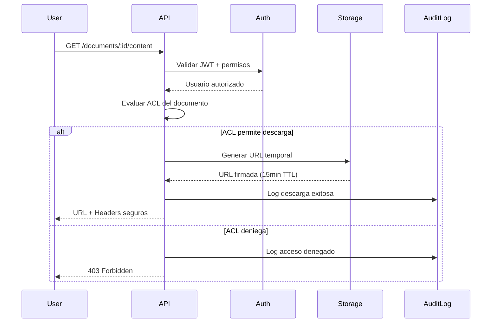
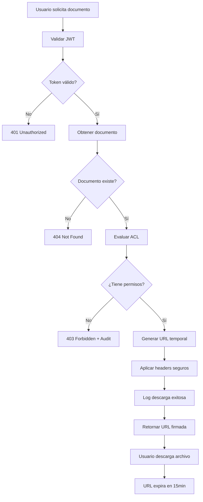

# DESIGN.md – Document Manager

## 1. Modelado de datos

### Colecciones y Relaciones

#### Collection: `documents`
```javascript
{
  _id: ObjectId,
  customerId: String,           // Índice: cliente/tenant
  processId: String,            // Proceso de negocio (opcional)
  taxonomy: {
    domain: String,             // legal, finance, hr, etc.
    category: String,           // contract, invoice, policy, etc.
    docType: String             // pdf, docx, image, etc.
  },
  currentVersion: Number,       // Versión actual activa
  acl: {
    owners: [String],           // IDs de propietarios
    readers: [String],          // IDs con permiso de lectura
    updaters: [String],         // IDs con permiso de modificación
    roles: [String]             // Roles del sistema (admin, legal, etc.)
  },
  retention: {
    policyId: String,           // Política aplicada
    deleteAt: Date,             // Fecha calculada de eliminación
    mode: String                // "soft" | "hard"
  },
  createdAt: Date,
  updatedAt: Date,
  deletedAt: Date               // Para soft delete
}
```

#### Collection: `documentVersions`
```javascript
{
  _id: ObjectId,
  documentId: String,           // Ref a documents._id
  version: Number,              // Número secuencial
  filename: String,
  mimeType: String,
  size: Number,
  hash: String,                 // SHA-256 para integridad
  storageKey: String,           // Clave en S3/almacenamiento
  status: String,               // "active", "archived", "deleted"
  createdBy: String,            // ID del usuario
  createdAt: Date
}
```

#### Collection: `auditLogs`
```javascript
{
  _id: ObjectId,
  documentId: String,           // Ref a documents._id
  version: Number,              // Versión afectada (opcional)
  action: String,               // "CREATE", "READ", "UPDATE", "DELETE", "DOWNLOAD"
  actorId: String,              // ID del usuario
  roles: [String],              // Roles del actor en el momento
  ip: String,                   // IP de origen
  userAgent: String,            // Agente del navegador
  timestamp: Date,
  result: String,               // "SUCCESS", "FAILED", "DENIED"
  reason: String                // Descripción adicional
}
```

### Índices Diseñados

```javascript
// Colección documents
db.documents.createIndex({ customerId: 1 })
db.documents.createIndex({ "taxonomy.domain": 1, "taxonomy.category": 1, "taxonomy.docType": 1 })
db.documents.createIndex({ "retention.deleteAt": 1 })
db.documents.createIndex({ deletedAt: 1 })

// Colección documentVersions
db.documentVersions.createIndex({ documentId: 1, version: 1 }, { unique: true })
db.documentVersions.createIndex({ documentId: 1, createdAt: -1 })

// Colección auditLogs
db.auditLogs.createIndex({ documentId: 1, timestamp: -1 })
db.auditLogs.createIndex({ timestamp: -1 })
db.auditLogs.createIndex({ actorId: 1, timestamp: -1 })
```

### Razones de Diseño

1. **Separación de versiones**: Cada versión es un documento independiente para facilitar versionamiento y rollback.
2. **ACL embebido**: Los permisos se almacenan en el documento principal para consultas rápidas.
3. **Taxonomía estructurada**: Permite filtros jerárquicos y políticas de retención por categoría.
4. **Auditoría completa**: Rastrea todas las acciones con contexto del usuario y resultado.

---

## 2. Contratos API

### Endpoints Implementados

#### Gestión de Documentos
- `POST /documents` - Crear documento
- `GET /documents` - Listar con filtros y paginación
- `GET /documents/:id` - Obtener documento específico
- `PATCH /documents/:id/acl` - Actualizar permisos
- `PATCH /documents/:id/retention` - Configurar retención
- `DELETE /documents/:id` - Eliminar (según política)

#### Gestión de Versiones
- `POST /documents/:id/versions` - Crear nueva versión
- `GET /documents/:id/versions` - Listar versiones

#### Acceso Seguro al Contenido
- `GET /documents/:id/content?version=N` - Descarga protegida

### DTOs Principales

```typescript
// Crear documento
CreateDocumentDto {
  customerId: string;
  processId?: string;
  taxonomy: TaxonomyDto;
  acl: AclDto;
  retention: RetentionDto;
}

// Filtros de búsqueda
FilterDocumentsDto {
  customerId?: string;
  domain?: string;
  category?: string;
  docType?: string;
  page?: number;
  limit?: number;
}
```

### Códigos de Error

- **400**: Datos de entrada inválidos
- **401**: No autenticado
- **403**: Sin permisos para la operación
- **404**: Documento/versión no encontrada
- **409**: Conflicto (versiones, ACL, retención)
- **422**: Error de validación de datos
- **500**: Error interno del servidor

---

## 3. Seguridad y ACL

### Modelo de Evaluación ACL

```typescript
interface AclEvaluation {
  canRead: boolean;
  canUpdate: boolean;
  canDelete: boolean;
  canDownload: boolean;
  canModifyAcl: boolean;
}

// Lógica de evaluación
function evaluateAcl(user: User, document: Document): AclEvaluation {
  const isOwner = document.acl.owners.includes(user.id);
  const isReader = document.acl.readers.includes(user.id);
  const isUpdater = document.acl.updaters.includes(user.id);
  const hasRole = user.roles.some(role => document.acl.roles.includes(role));
  
  return {
    canRead: isOwner || isReader || isUpdater || hasRole,
    canUpdate: isOwner || isUpdater,
    canDelete: isOwner || user.roles.includes('admin'),
    canDownload: isOwner || isReader || isUpdater || hasRole,
    canModifyAcl: isOwner || user.roles.includes('admin')
  };
}
```

### Autenticación/Autorización Esperada

1. **JWT Tokens**: Portador en header Authorization
2. **Roles del Sistema**: admin, legal, finance, hr, user
3. **Tenant Isolation**: customerId asegura separación por cliente
4. **Permisos Granulares**: Diferencia entre leer metadatos vs. descargar binario

---

## 4. Visualización Segura

### Patrón Propuesto



### Headers de Seguridad

```http
Cache-Control: no-cache, no-store, must-revalidate
Pragma: no-cache
Expires: 0
Content-Disposition: attachment; filename="documento.pdf"
X-Content-Type-Options: nosniff
X-Frame-Options: DENY
Content-Security-Policy: default-src 'none'
```

### Control de Descarga vs. Visualización

- **Solo Visualización**: Content-Disposition: inline; sandbox iframe
- **Descarga Permitida**: Content-Disposition: attachment
- **URLs Temporales**: Firmadas con TTL de 15 minutos
- **Watermarking**: Aplicar marca de agua con usuario y timestamp

---

## 5. Retención y Borrado

### Cálculo de deleteAt

```typescript
interface RetentionPolicy {
  id: string;
  name: string;
  duration: string; // "30d", "1y", "7y", "permanent"
  triggers: {
    taxonomy?: TaxonomyFilter;
    customerId?: string;
    global?: boolean;
  };
}

// Políticas ejemplo
const policies: RetentionPolicy[] = [
  { id: "legal-contracts", duration: "7y", triggers: { taxonomy: { domain: "legal" } } },
  { id: "finance-invoices", duration: "5y", triggers: { taxonomy: { domain: "finance" } } },
  { id: "hr-general", duration: "3y", triggers: { taxonomy: { domain: "hr" } } },
  { id: "default", duration: "1y", triggers: { global: true } }
];

function calculateDeleteAt(document: Document): Date {
  const policy = findApplicablePolicy(document);
  return addDuration(document.createdAt, policy.duration);
}
```

### SOFT vs. HARD Delete

**SOFT Delete:**
- Marca `deletedAt` en el documento
- Mantiene versiones y metadatos
- Permite recuperación durante período de gracia
- Se aplica por defecto

**HARD Delete:**
- Elimina documento, versiones y archivos físicos
- Mantiene solo registros de auditoría
- Irreversible
- Se aplica después del período de gracia o por política específica

### Proceso de Limpieza (Conceptual)

```typescript
// Cron job diario
async function retentionCleanupJob() {
  const now = new Date();
  
  // SOFT deletes vencidos
  const expiredDocs = await findDocuments({
    'retention.deleteAt': { $lte: now },
    deletedAt: null
  });
  
  for (const doc of expiredDocs) {
    await softDelete(doc._id);
    await auditLog({
      documentId: doc._id,
      action: 'AUTO_SOFT_DELETE',
      result: 'SUCCESS',
      reason: 'Retention policy expired'
    });
  }
  
  // HARD deletes después de período de gracia
  const gracePeriodExpired = await findDocuments({
    deletedAt: { $lte: subDays(now, 30) },
    'retention.mode': 'hard'
  });
  
  for (const doc of gracePeriodExpired) {
    await hardDelete(doc._id);
    await auditLog({
      documentId: doc._id,
      action: 'AUTO_HARD_DELETE',
      result: 'SUCCESS',
      reason: 'Grace period expired'
    });
  }
}
```

---

## 6. Evolución a 2 Sprints

### Sprint 1 (2 semanas): Funcionalidad Core
**Objetivo**: MVP funcional con casos de uso básicos

**Entregables:**
1. **CRUD Completo**: Todos los endpoints con lógica real
2. **Integración MongoDB**: Conexión real y operaciones
3. **ACL Básico**: Evaluación de permisos en endpoints
4. **Subida de Archivos**: Endpoint para binarios (local/S3)
5. **Auditoría Básica**: Log de acciones principales
6. **Swagger Completo**: Documentación interactiva
7. **Tests Unitarios**: DTOs y lógica de ACL

**Criterios de Aceptación:**
- Crear, leer, actualizar y eliminar documentos
- Subir y descargar archivos reales
- Permisos básicos funcionando
- Auditoría de acciones críticas

### Sprint 2 (2 semanas): Seguridad y Producción
**Objetivo**: Sistema seguro y listo para producción

**Entregables:**
1. **Autenticación JWT**: Implementación completa
2. **Visualización Segura**: URLs temporales y headers
3. **Retención Automática**: Cron jobs y políticas
4. **Integración S3**: Almacenamiento en nube
5. **Logging Avanzado**: Winston/Pino con requestId
6. **Tests E2E**: Flujos completos de usuario
7. **Docker**: Containerización
8. **Monitoreo**: Health checks y métricas

**Criterios de Aceptación:**
- Sistema completamente autenticado
- Descarga segura con URLs temporales
- Eliminación automática por retención
- Logs estructurados y auditables
- Deployable en producción

### Estimaciones
- **Sprint 1**: 60-80 horas (dev + testing)
- **Sprint 2**: 40-60 horas (seguridad + ops)
- **Total**: ~120 horas para MVP completo

---

## 7. Diagrama de Flujo de Visualización Segura


